# DOBOT Nova 5 Control UI

Version: `v0.0.1.5`

DOBOT Nova 5 Control UI is a local control and automation interface for DOBOT
Nova 5 and Nova5 controllers. It connects through DOBOT TCP/IP secondary
development, manages robot state, records motion sequences, routes OSC events,
and runs interactive robot workflows.

The repository includes the control dashboard, local robot-control Python code,
game workflow pages, sounds, bundled runtime libraries, MotorControl helper
files, saved mapping files, and robot visual assets.

## Project Scope

This project is focused on DOBOT Nova 5 robot control, DOBOT TCP/IP control,
Python-based robot automation, motion sequence recording, OSC-triggered robot
actions, and practical workflow control for demonstrations, games, and physical
interaction setups.

## Safety Notice

This software can move a real robot.

Before sending motion:

- Keep people, tools, cables, and loose objects out of the robot workspace.
- Keep the emergency stop reachable.
- Start with low speed and small step values.
- Confirm the current joint and pose values before moving.
- Test saved sequences in preview/test mode before live robot mode.
- Do not run unknown commands on a live robot.
- Stop immediately if the robot path is not what you expected.

## Requirements

Installable Windows dependency:

- Python `3.10` or newer

The launcher automatically checks and installs Python package dependencies:

- `numpy>=1.24`

You also need:

- Windows 10 or Windows 11
- A modern browser, Chrome or Edge recommended
- Internet for first setup if `numpy` is missing
- Laptop and DOBOT controller on the same LAN/subnet
- DOBOT controller configured for TCP/IP secondary-development mode

You do not need to install Node.js, Visual Studio, DOBOT SDK, Three.js,
Stockfish, or a separate chess package. DobotStudio Pro is not required for
normal use after the robot is already configured for TCP/IP control, but it may
still be needed once when setting up a new robot/controller or changing network
settings.

## Quick Start

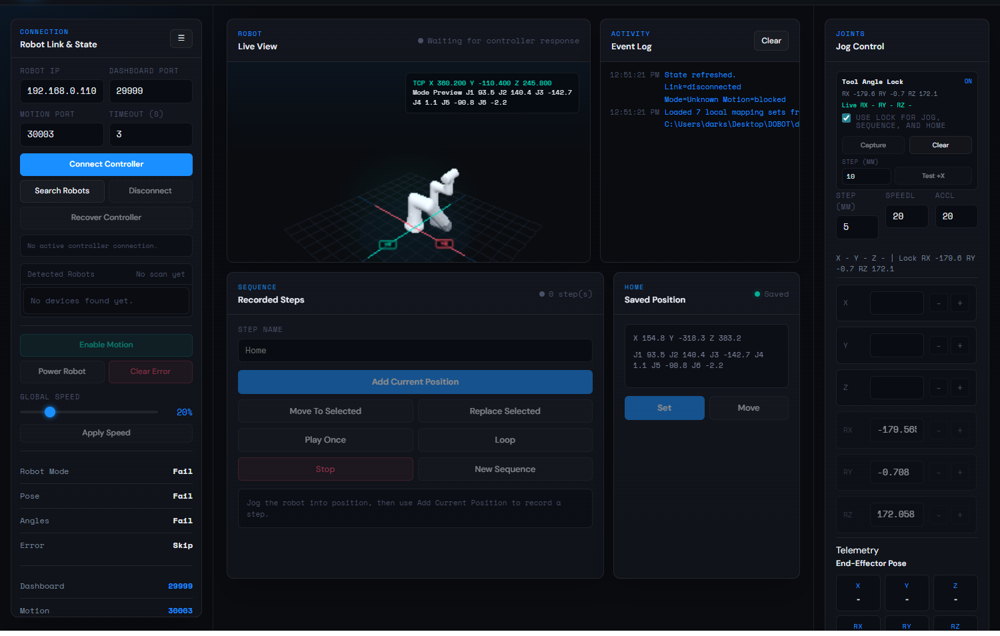

1. Download the GitHub repository as a ZIP, or clone it.
2. Extract the folder.
3. Open the extracted release folder.
4. Double-click `DOBOT Nova 5 Control UI.exe`.
5. If Windows Firewall asks for access, allow Python on private networks.
6. The browser should open automatically at `http://127.0.0.1:8765`.

If the executable launcher is blocked or unavailable, use the fallback launcher:

```powershell
.\DOBOT UI Launcher.bat
```

## Auto Dependency Check

The release launcher:

- Looks for the Python launcher `py`.
- Falls back to `python` if `py` is not found.
- If Python is missing, offers to install Python 3.12 with `winget`.
- Checks that Python is at least version `3.10`.
- Checks required Python packages from `requirements.txt`.
- Installs missing packages with `pip`.
- Starts `dobot_ui.py`.
- Opens the browser automatically.

If Python is missing and `winget` is not available, install Python manually from:

`https://www.python.org/downloads/windows/`

When installing Python manually, enable the option that adds Python to `PATH`.

## Folder Layout

```text
DOBOT-Nova5-Control-UI-v0.0.1.5/
  DOBOT Nova 5 Control UI.exe
  DOBOT UI Launcher.bat
  README.md
  VERSION
  .gitignore
  .gitattributes
  docs/
    images/
  assets/
    dobot.ico
  tools/
    launcher/
  dobot/
    run.bat
    bootstrap.py
    requirements.txt
    dobot_ui.py
    dobot_nova5.py
    servoCT.py
    game_mappings_saved.json
    tictactoe_setup_saved.json
    sounds/
    servo_control/
    webui/
```

Important folders:

- `dobot/` contains the application server and robot-control code.
- `dobot/webui/` contains the browser interface.
- `dobot/webui/models/` contains the live 3D robot-view assets.
- `dobot/webui/vendor/` contains browser libraries bundled with the release.
- `dobot/sounds/` contains local game/voice audio files.
- `dobot/servo_control/` contains the bundled MotorControl helper.
- `assets/dobot.ico` contains the launcher icon.
- `tools/launcher/` contains the small launcher source used to build the `.exe`.
- `docs/images/` contains the README screenshots.

The release excludes development archives, logs, Python caches, temporary
browser profiles, old test screenshots, and the non-runtime STEP source model.

## Launcher

The recommended launcher is:

```text
DOBOT Nova 5 Control UI.exe
```

It starts the portable batch launcher from the extracted folder and keeps the
same dependency checks. The batch launcher remains available as a fallback:

```text
DOBOT UI Launcher.bat
```

The `.exe` is unsigned, so Windows may show a security prompt the first time it
is opened.

## Network Setup

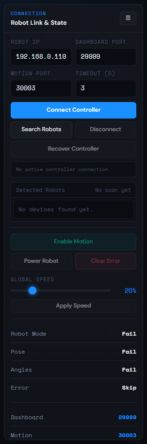

Default robot settings:

- Robot IP: `192.168.0.110`
- Dashboard port: `29999`
- Motion port: `30003`
- Feedback port: `30004`

Connection requirements:

- Laptop and robot must be on the same LAN/subnet.
- DOBOT controller must be in TCP/IP secondary-development mode.
- Windows Firewall must allow Python on private networks.
- Dashboard and motion TCP ports must be reachable.

The Connection panel lets you enter robot IP/ports, connect, disconnect, scan
for reachable robots, recover controller state where supported, and collapse the
left drawer to free workspace.

## Main Dashboard


The main dashboard is the default screen. It keeps robot controls visible while
the center workspace changes between live view and game setup pages.

It shows robot host, link state, robot mode, motion state, drag state, live joint
values, live TCP pose, event log messages, game entry, theme toggle, and refresh
controls.

## Robot State And Actions

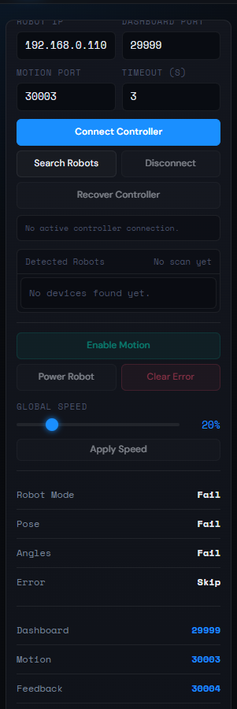

The Robot Link & State panel contains:

- `Connect Controller`: opens dashboard/motion communication.
- `Search Robots`: scans the nearby subnet for reachable controller ports.
- `Disconnect`: stops the UI connection/polling path.
- `Recover Controller`: tries safe recovery actions for a stuck queue/state.
- `Enable Motion`: enables motion when controller state allows it.
- `Power Robot`: sends the robot power command.
- `Clear Error`: clears visible controller alarms where allowed.
- `Apply Speed`: applies the global speed percentage.

Diagnostic rows show robot mode, pose, joint angles, error state, and protocol
ports.

## Robot Visual Monitor

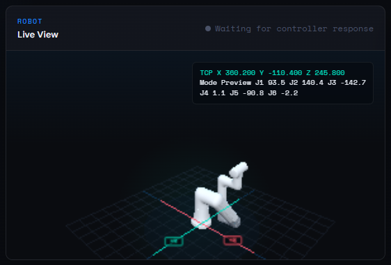

The Live View card renders a Nova 5 visual monitor.

It is used for:

- Seeing the robot shape from joint telemetry.
- Checking J1 through J6 values visually.
- Viewing TCP pose text near the live model.
- Orbiting the view with the mouse.

The visual assets are bundled locally. They do not download model/rendering
files from the internet during normal use. Render quality is set conservatively
for lower CPU/GPU load on laptops.

## Joint Jog Controls

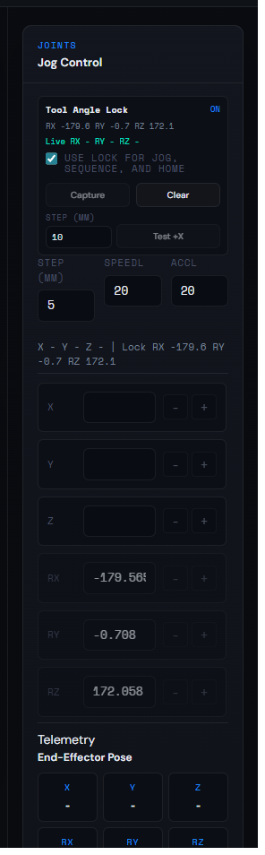

The Jog Control panel is on the right side of the dashboard.

It includes J1 through J6 controls, positive/negative jog buttons, step size,
speed, acceleration, live joint readouts, and end-effector pose values. Use it
for small manual checks and alignment work.

## Tool Angle Lock

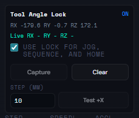

Tool Angle Lock can capture the current tool orientation and reuse it during
jog, sequence, and home operations. When enabled, X/Y/Z jog movement can keep
the captured RX/RY/RZ orientation. Use it only after confirming the current tool
orientation is the one you want.

## Sequence Editor

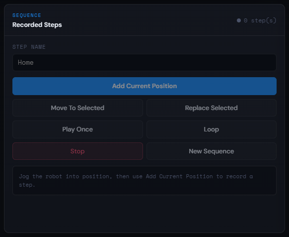

The sequence panel stores repeatable robot positions and simple motion routines.

It can save the current robot position as a named step, move to a selected step,
replace a selected step, play once, loop, stop, create a new sequence, and save
or move to a home position. Live capture requires robot telemetry.

## Drag And Position Capture

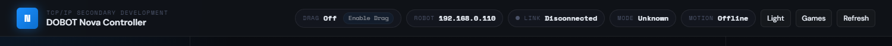

The top bar includes drag status and `Enable Drag`. Drag/manual positioning is
useful for guiding the robot to a physical target and then capturing that live
position into a sequence or board mapping. Capture depends on live telemetry.

## Games Menu

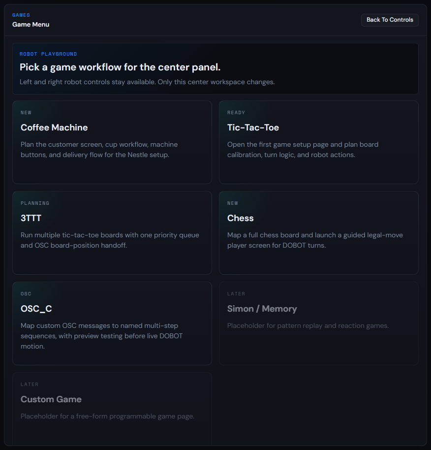

The Games button opens the game/workflow menu in the center panel. Available
modules are Coffee Machine, Tic-Tac-Toe, 3TTT, Chess, and OSC_C. The left
connection panel and right jog panel remain available while the center workspace
changes.

## Chess Setup

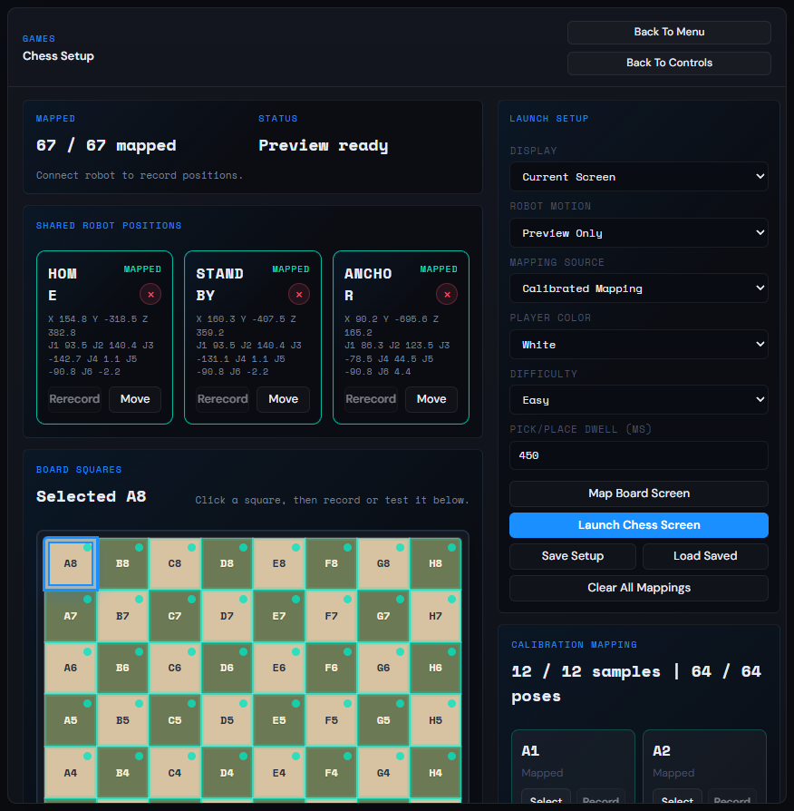

The Chess setup page prepares the robot chess workflow.

It includes full board mapping, square selection, mapped/calculated square
indicators, capture/load/save controls, calibration samples, player color,
difficulty settings, and preview mode.

Light workflow summary:

- The user plays on a browser chess board.
- The setup maps chess squares to physical robot positions.
- Saved mapping lets the robot workflow know where board squares are.
- The live chess screen guides legal player moves and robot turns.

## Chess Player Screen

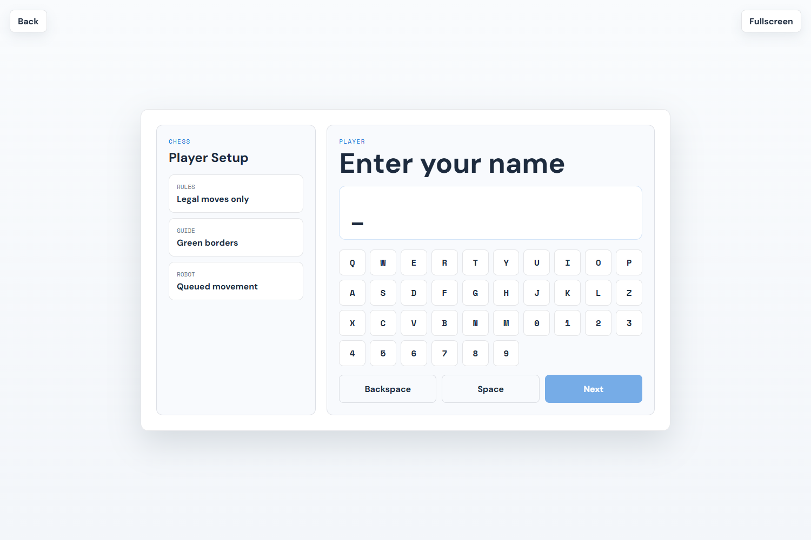

The Chess player screen includes player name entry, side selection, difficulty
selection, a large playable chess board, highlighted move guidance, move list,
and visible player/robot/game state.

## Tic-Tac-Toe Setup

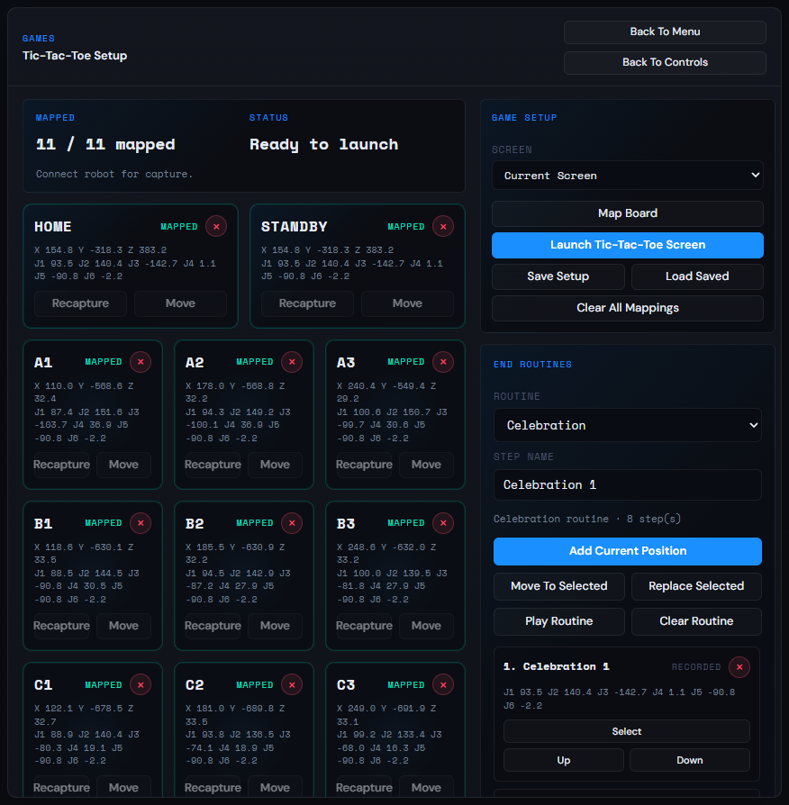

The Tic-Tac-Toe setup page prepares a single board game workflow. It includes
board mapping progress, live-position capture note, board map grid, display
selection, map/launch controls, save/load controls, and end routine recording
for celebration or loss moves.

## 3TTT Setup

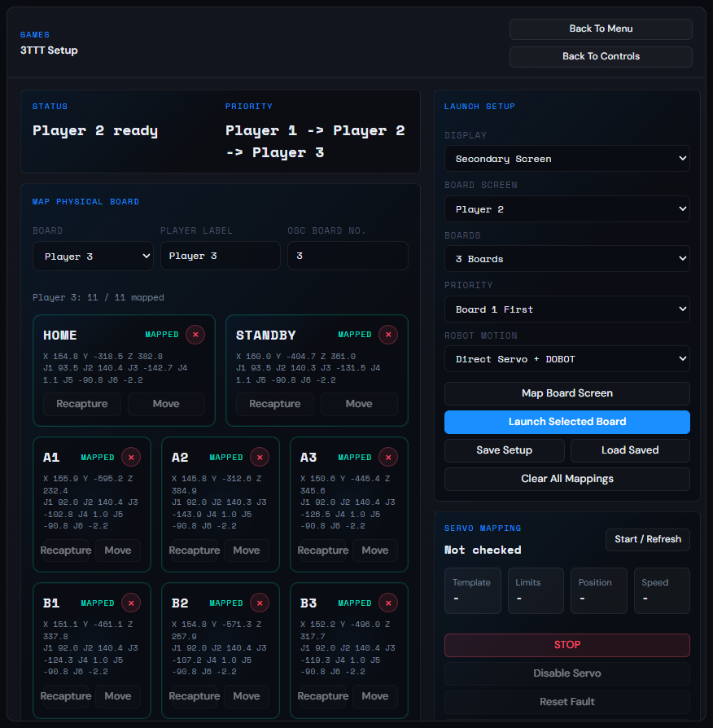

The 3TTT page is a multi-board tic-tac-toe workflow designed for multiple
boards, per-board mapping, one robot movement queue, OSC board-position handoff,
and preview testing before live robot motion.

## Coffee Machine Workflow

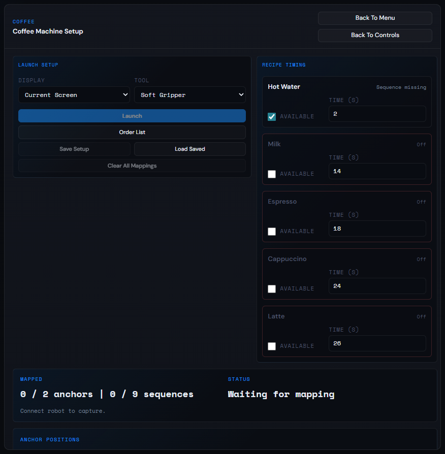

The Coffee page prepares a physical coffee-machine demo workflow. It includes
customer display selection, gripper selection, setup save/load controls, machine
anchor mapping, drink/button target mapping, recipe/routine list, and readiness
status.

## OSC_C Sequence Control

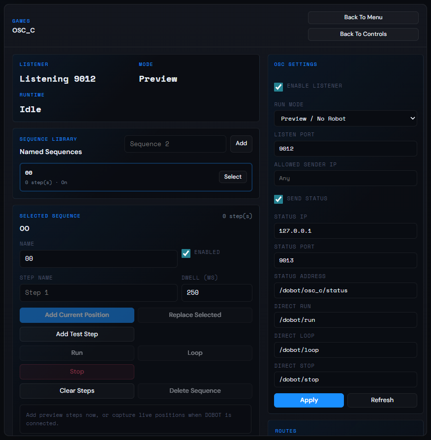

OSC_C maps incoming OSC messages to named robot sequences. It supports
preview/no-robot mode, live robot mode, named sequences, step names, dwell
times, add current position, replace selected step, add test step, run, loop,
stop, and clear controls.

Use preview mode while building the route table and sequence timing.

## OSC_C Route Editor

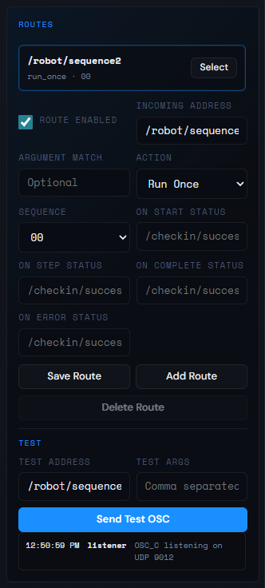

The route editor connects OSC addresses to actions. Each route can define
enabled state, incoming OSC address, optional argument match, action type,
target sequence, and custom status addresses for start, step, complete, and
error. The test panel sends local OSC messages into the listener for checking
routes before using another OSC sender.

## Light And Dark Theme

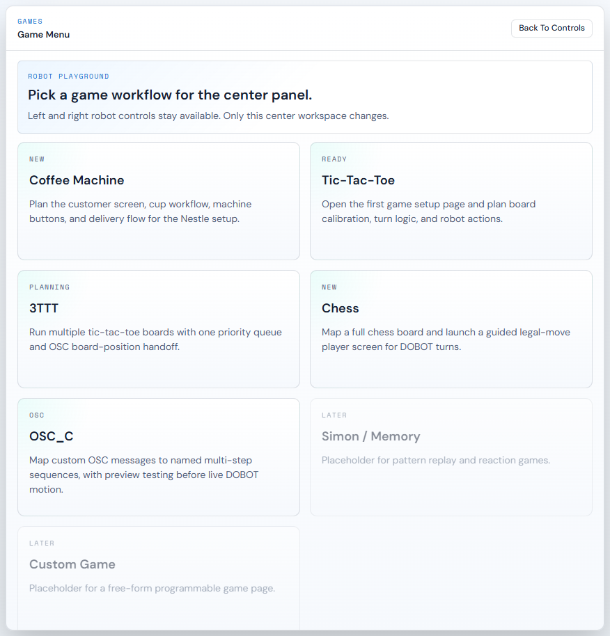

The top bar includes a Light/Dark toggle. The selected theme is saved in browser
local storage, and the dashboard/game setup panels use theme-aware colors.

## Troubleshooting

### Python Not Found

Run `DOBOT UI Launcher.bat`. If Python is missing, the launcher offers to
install Python 3.12 using `winget` when available.

Manual install:

`https://www.python.org/downloads/windows/`

### Dependency Install Failed

From the `dobot` folder:

```powershell
python -m pip install -r requirements.txt
python bootstrap.py --open-browser
```

### Browser Opens But Robot Does Not Connect

Check robot IP, network subnet, TCP/IP secondary-development mode, ports
`29999`, `30003`, `30004`, Windows Firewall, robot power/enable state, and
active alarms.

### Robot Visual Is Blank

Use Chrome or Edge and confirm WebGL is enabled. The visual files are local, so this
is usually a browser/GPU/WebGL issue rather than an internet issue.

### Port 8765 Is Already In Use

Run on another port:

```powershell
cd dobot
python dobot_ui.py --port 8766 --open-browser
```

### Robot Is Reachable But Will Not Move

Check robot mode, error/alarm state, whether motion is enabled, whether the
queue needs `Continue`, whether TCP/IP mode is still active, and whether the
target pose is inside the robot workspace.

## Developer Notes

Runtime starts here:

```powershell
dobot\run.bat
```

Manual start:

```powershell
cd dobot
python bootstrap.py --open-browser
```

Development syntax checks used for this release:

```powershell
python -m py_compile bootstrap.py dobot_ui.py dobot_nova5.py servoCT.py
node --check webui\app.js
node --check webui\robot-live-view.js
node --check webui\chess.js
node --check webui\3ttt.js
node --check webui\coffee.js
node --check webui\game.js
```

Node.js is not required for users. It is only useful for development-time
JavaScript syntax checks.
